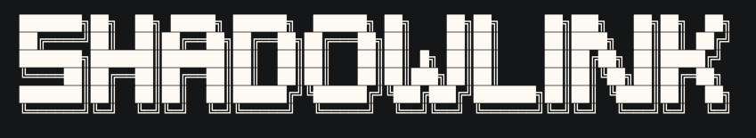

# ShadowLink

_Server to access and moniter your PC from anywhere in the world_

- ShadowLink is a secure, remote access server, helping you to access your PC's resources from anywhere via an authenticated web interface.

- Tunneling with **Ngrok** allows global access, while token-based authentication ensures secure connections.


> *Before using ShadowLink, you must read the [Security Notice](#important-security-notice). It contains critical risks and setup requirements — skipping it could leave your system fully exposed.*


<div align="center">

</div>

| **Route** | **Description**                                                                                                                                          | **Screenshot** |
| --------- | -------------------------------------------------------------------------------------------------------------------------------------------------------- | -------------------------- |
| `/home`   | Authenticated home page |       |
| `/snap`   | Displays two images: (1) Screenshot of the screen, and (2) Image captured using Webcam. _Both images are instantly taken the moment you visit this route._     |   |
| `/logs`   | Server logs  |       |
| `/login`  | Login page   |     |
| `/watch` | Watch the live webcam stream for 20sec |                            |
| `/logout` | Logout route |                                                |


## Setup Instructions

1. **Clone the repository**

   ```bash
   git clone https://github.com/AdityaBavadekar/shadowlink.git
   cd shadowlink
   ```

2. **Create `.env` file**

   * On Unix/Linux/macOS:

     ```bash
     cp .env.example .env
     ```
   * On Windows:

     ```powershell
     copy .env.example .env
     ```
   * Edit `.env` to update:

     * `AUTH_USERNAME`
     * `AUTH_PASSWORD`
     * `JWT_SECRET`

3. **Install dependencies**
   - 1
      ```bash
      pnpm install
      ```
   - 2
      ```bash
      pip install -r requirements.txt
      ```

4. **Run the server locally**

   ```bash
   pnpm run dev
   ```

   * Server will be live at: [http://localhost:8800](http://localhost:8800)

5. **(Optional) Expose your server via Ngrok**

   Use your preferred method to expose port `8800`:

     ```bash
     ngrok http 8800
     ```

6. **(Optional (Linux only)) Auto start server and Ngrok - Instead of running 2 steps everytime, direct bash script**

   Run the helper script:

   ```bash
   ./run.sh
   ```

## Important Security Notice

> DO NOT SKIP THIS

**ShadowLink is intended for educational and small-scale personal use only. It is not designed for production or enterprise environments.**

This tool provides remote access and command execution capabilities on your PC. If misconfigured or improperly secured, it can lead to full system compromise. Use with caution.

### Key Security Considerations

* ShadowLink allows remote shell command execution via the `execSync` method. This enables full control of your system from the browser. Improper access can lead to remote code execution.

* Login credentials are stored in plain text in the `.env` file. This file must be secured and never shared or committed to version control.

* The application is not made for public or large-scale use. Exposing it directly to the internet for longer period of time is strongly discouraged.

* A user with write access to the codebase can delete it or modify the application to bypass authentication entirely. File permissions alone are not sufficient security.

### Recommendations

* Use strong, unique credentials.
* Do not run the server with root or administrator privileges.
* Restrict access using a firewall, VPN, or IP filtering.
* Log and monitor all access and command usage.
* Create a dedicated system user with minimal permissions for running this server.

**Use at your own risk. Proper security configuration is your responsibility.**


## License
```
   Copyright 2025 Aditya Bavadekar

   Licensed under the Apache License, Version 2.0 (the "License");
   you may not use this file except in compliance with the License.
   You may obtain a copy of the License at

       http://www.apache.org/licenses/LICENSE-2.0

   Unless required by applicable law or agreed to in writing, software
   distributed under the License is distributed on an "AS IS" BASIS,
   WITHOUT WARRANTIES OR CONDITIONS OF ANY KIND, either express or implied.
   See the License for the specific language governing permissions and
   limitations under the License.

```